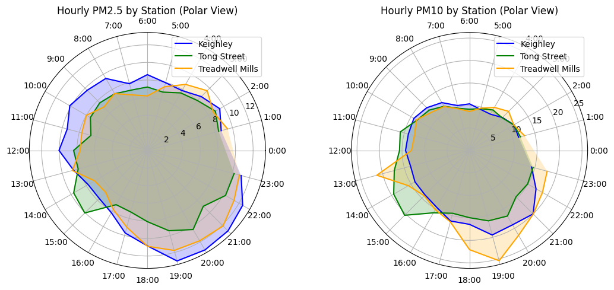
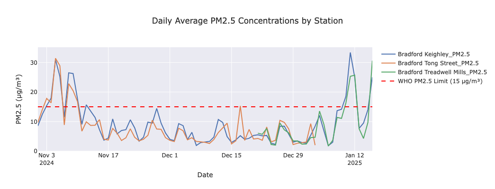
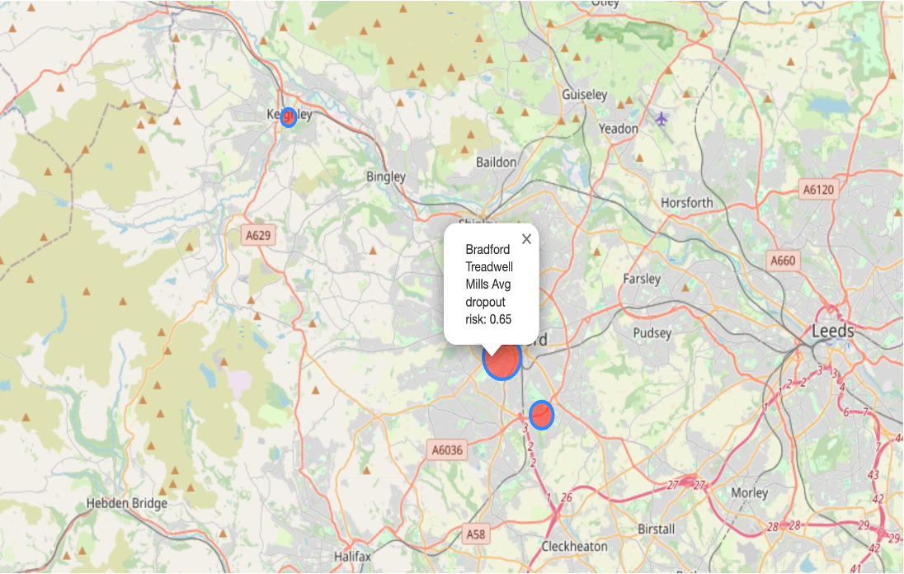

❄️ Winter Air Quality and Sensor Failure Analysis in Bradford, UK
This project explores wintertime air pollution trends in Bradford, UK, focusing on PM2.5 and PM10 pollutant levels and the influence of meteorological conditions and sensor reliability during data collection. The project combines data analysis, visualization, and predictive modeling to better understand pollution dynamics and prepare for high-risk periods.

📊 Project Components
1. Air Quality Analysis (Analysis.ipynb)  
Investigates PM2.5 and PM10 levels during winter (Nov–Jan).
### 📊 Daily PM2.5 Levels vs WHO Limit

*Daily average PM2.5 concentrations in Bradford (Nov–Jan), compared across stations with WHO limit (15 µg/m³). Multiple exceedances observed.*

Assesses daily trends, diurnal patterns, and pollution spikes.
Includes historical comparison across 2022–2025 winters.
WHO pollution threshold breaches are visualized and interpreted.
### 🌙 Diurnal Pattern of PM2.5 and PM10

*Hourly average PM levels show late-night and early-morning spikes — likely due to traffic and heating.*
Evaluates weather influences (wind, humidity, temperature).

3. Sensor Failure Modeling (Sensor_Failure_Analysis.ipynb)
Detects negative/missing readings caused by sensor drift or weather anomalies.
Models sensor dropout probability using logistic regression (GLM).
Identifies high-risk stations (e.g., Treadwell Mills).
Evaluates environmental causes of sensor unreliability (cold, wind, heat).

### 🛰️ Sensor Dropout Risk Map

*Sensor failure risk by location. Treadwell Mills showed the highest average dropout probability (0.65), likely due to weather.*

4. Presentation (Shreenika_ppt.pptx)
A clean, visually engaging summary of the project including:
Pollution patterns

Weather correlations

Predictive modeling (XGBoost)

Sensor reliability map

Future roadmap

📦 Data Sources
Dataset	Source
Air Quality (PM2.5, PM10)	UK Air Quality Network
Weather (Temp, Wind, RH)	Meteostat API
Holiday Data	UK Gov Bank Holidays

Data covers Nov 1 – Jan 17 for multiple years (2022–2025).

📈 Key Findings
PM2.5 exceeded WHO guidelines multiple times, especially in the evening hours.
Wind speed was the strongest inverse influencer on PM levels.
Weekends and holidays show distinct pollution patterns.
Sensor failures are often tied to extreme environmental conditions.
XGBoost models provided strong PM2.5 forecasting with R² values up to 0.69.

🧠 Technologies Used
Python (Pandas, Seaborn, Sklearn, XGBoost, Statsmodels)
Jupyter Notebooks
Meteostat API
Logistic Regression (GLM)
XGBoost Regression

🚧 Future Work
Add boundary-layer height, wind direction, and real-time traffic.
Use advanced models like LSTM or Temporal CNNs.
Automate data ingestion, model retraining, and real-time dashboards.
Build alert systems for pollution threshold breaches.
